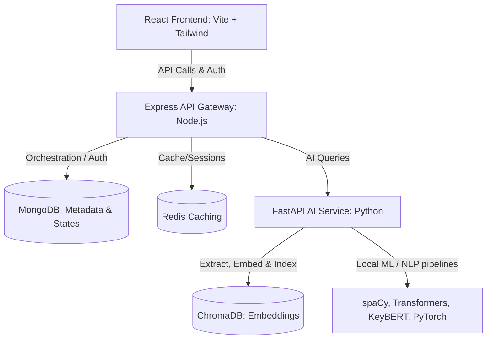

# FirstStep Digital Edu Platform

> "Learn Smarter, Think Better."

FirstStep is an intelligent digital learning companion and educational platform designed specifically for rural students in India. Using modern Artificial Intelligence, Machine Learning, Natural Language Processing, and Learning Science, FirstStep aims to bridge educational gaps by providing modular, cognitive-first tools that assist students throughout their academic journey.

---

## 🏗️ System Architecture

The project is structured as a feature-based monorepo consisting of:



- **Frontend (Vite / React / Tailwind)**: Sleek, fluid, and responsive dashboard following Notion-like minimalist and functional aesthetics.
- **Backend API Gateway (Express / Node.js)**: Security, authentication, state routing, DB interactions, and caching logic.
- **AI Service (FastAPI / Python)**: Independent execution engine containing specific NLP pipelines (Embeddings, Summarization, Mind Maps, Question Generation, Learning Twin Analytics).

---

## 📁 Repository Structure

```text
FIRST_STEP/
├── backend/            # Express API Gateway
│   ├── src/
│   │   ├── controllers/
│   │   ├── middlewares/
│   │   ├── models/
│   │   └── routes/
│   ├── Dockerfile
│   └── package.json
├── ai_service/         # FastAPI ML Pipelines
│   ├── app/
│   │   ├── core/
│   │   ├── pipelines/
│   │   └── routers/
│   ├── Dockerfile
│   └── requirements.txt
├── frontend/           # Vite React Web App
│   ├── src/
│   │   ├── components/
│   │   ├── features/
│   │   └── pages/
│   └── package.json
└── docker-compose.yml  # Local multi-service orchestration
```

---

## 🚦 Local Startup Guide

To boot up the entire stack using Docker Compose:

```bash
docker-compose up --build
```

Alternatively, you can run the components locally in separate terminals:

### 1. Express Backend
```bash
cd backend
npm install
npm run dev
```

### 2. FastAPI AI Service
```bash
cd ai_service
pip install -r requirements.txt
python -m spacy download en_core_web_sm
uvicorn main:app --reload --port 8000
```

### 3. React Frontend
```bash
cd frontend
npm install
npm run dev
```
